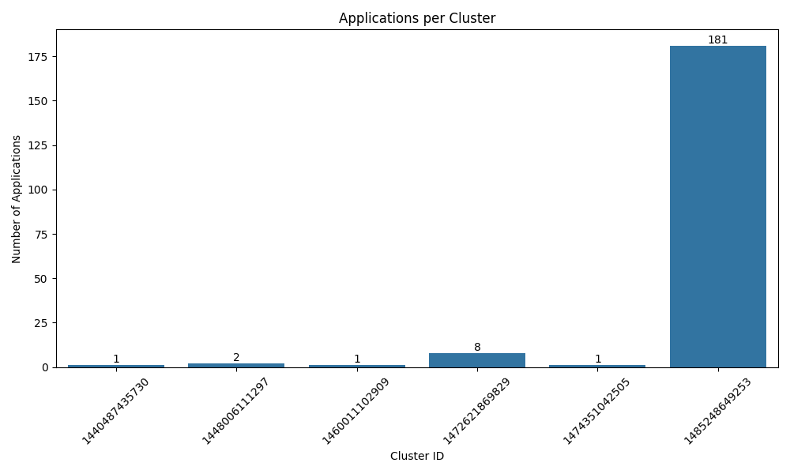
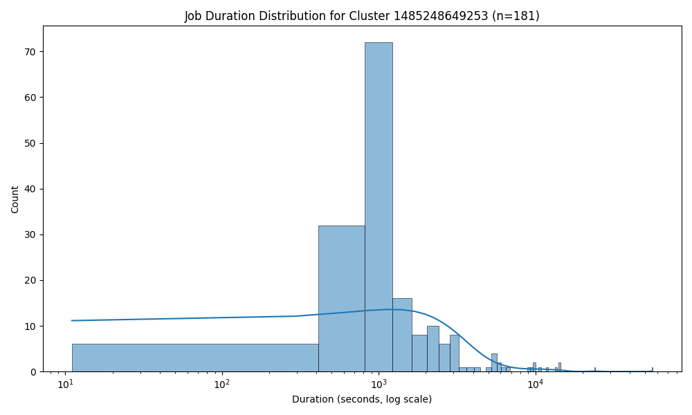
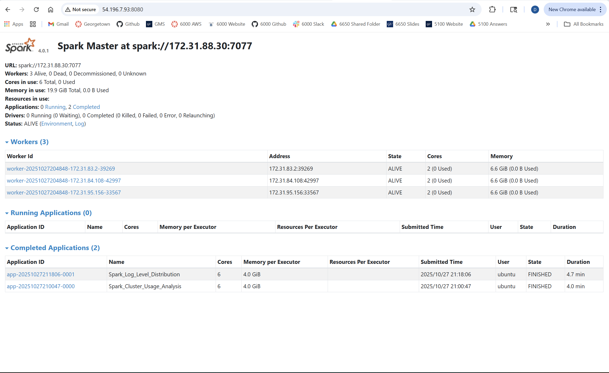
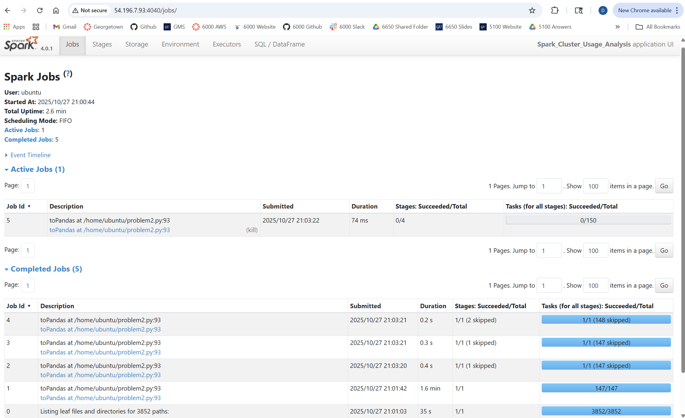
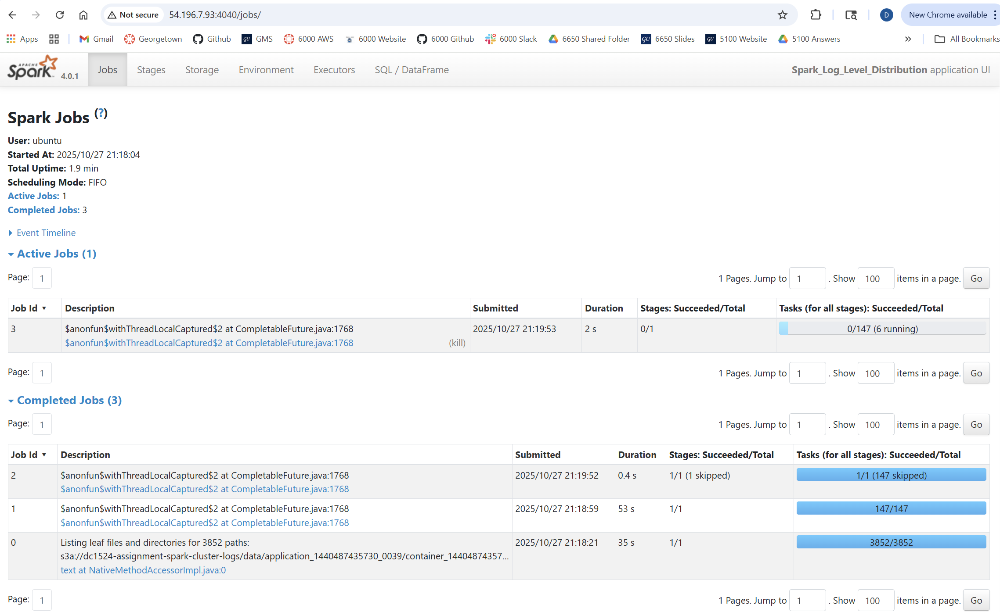

# Analysis Report

## Overview
This report summarizes the methodology, analytical findings, and performance insights derived from the Spark-based cluster log analysis assignment, which consisted of two primary tasks. Problem 1 focused on analyzing log level distributions and extracting a sample of log entries, while Problem 2 examined cluster usage patterns through timeline aggregation and visualization. In both tasks, the input consisted of raw log data stored in an S3 bucket and data was processed through PySpark, with resulting datasets and graphics saved locally.

---

## Problem 1: Log Level Distribution

### Approach
The analysis began by creating Spark session configured with Kryo serialization and S3 access from an IAM role. Raw log text files were loaded from the S3 path `s3a://dc1524-assignment-spark-cluster-logs/data/*/*`. A regular expression was applied to extract log levels such as `INFO`, `WARN`, `ERROR`, and `DEBUG`. Lines without valid log levels were excluded from further analysis. Aggregation was performed to count the frequency of each log level, and a random sample of ten valid log lines was captured to verify the correctness of the previous steps. All results (counts, sampled entries, and summary statistics) were written to the `data/output` directory and copied to my local computer.

### Key Findings
The analysis processed a total of *33,236,604* log lines, with *27,410,336* containing valid log levels. `INFO` messages dominated the logs, accounting for approximately 99.92% of valid entries, while `ERROR` and `WARN` messages each represented only 0.04%. No `DEBUG` messages were detected during parsing. The sample logscorrectly verified the successful extraction of structured information. These findings indicate that most logs reflect standard informational events, with few operational warnings or failures.

### Performance Observations
Spark completed the workload in parallel across the cluster and demonstrated strong efficiency. The job record for Spark_Log_Level_Distribution indicates a successful run that finished in approximately 4.7 minutes using 6 executors with 4.0 GiB of allocated memory. The use of transformations reduced overhead and improved the execution timeline for repeated operations, confirming effective resource utilization throughout the processing of the log dataset.

---

## Problem 2: Cluster Usage Timeline and Visualizations

### Approach
For the second task, the same raw logs acted as inputs, but additional parsing was applied to obtain `application_id` and `cluster_id` from all file paths. Timestamps were parsed into Spark timestamp types to support later temporal analysis. Using group-based aggregation and window functions, the workflow computed each application’s start and end times as well as cluster-level summaries. The resulting data outputs were saved as timeline and summary CSV documents. Visualizations were made using Pandas, Seaborn, and Matplotlib, producing a bar chart of application volume per cluster and a log-scaled histogram displaying job duration characteristics for the most active cluster.

### Key Findings
The timeline analysis identified 6 unique clusters and a combined total of 194 applications, averaging 32.33 per cluster. Workload distribution showed a great imbalance in applications, with some clusters performing significantly more jobs than others. Duration analysis showed a right-skewed distribution with a long-tail effect, indicating that while most applications finished within a predictable range, a subset of applications still required much more runtime.

### Explanation of Visualizations
The Applications per Cluster Bar Plot below shows differences in workload intensity by showing application counts for each individual cluster. This distinguishing the most utilized systems:



The Job Duration Histogram below uses a logarithmic scale to demonstrate the distribution of execution times and identifies the presence of more rare long-running tasks:



### Performance Observations
Spark executed the aggregation and temporal calculations efficiently. According to the cluster job record, the application Spark_Cluster_Usage_Analysis completed successfully in approximately 4.0 minutes using 6 executors with 4.0 GiB of allocated memory. Observations in the Spark Web UI further confirmed optimal cluster execution, balanced task scheduling, and minimal partition-related skew. Once the CSV outputs were persisted, visualization generation completed without notable delays.

## Spark Web UI Observations
Through the Spark Web UI, I verified that Spark stages were well-distributed across nodes and that strategies/approaches supported efficient parallel processing. Screenshots of core Spark UI components were recorded for supporting documentation:

```markdown



```